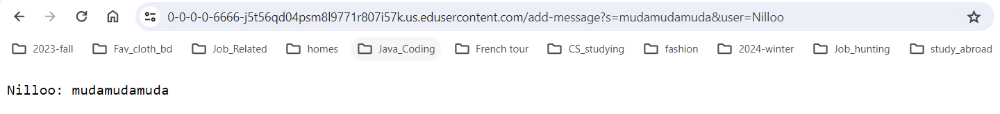
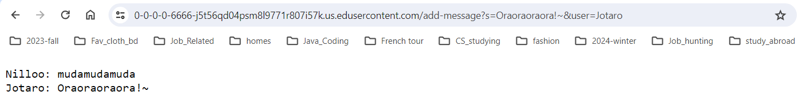
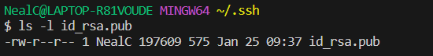
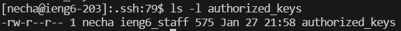
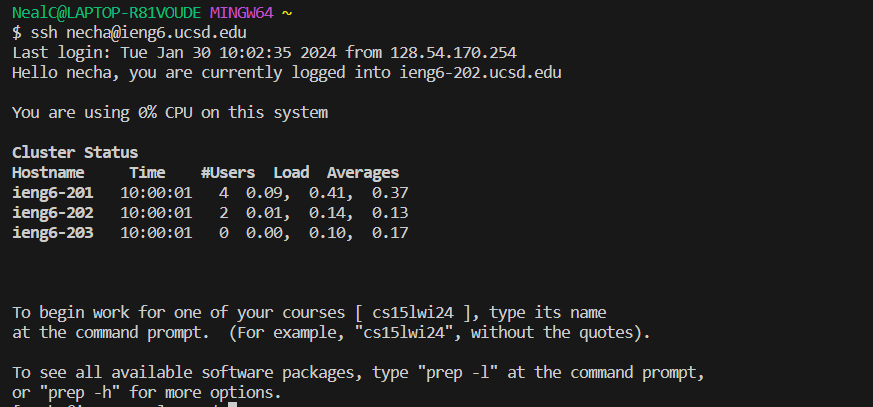

# Lab Report 2
## Code 
```
import java.io.IOException;
import java.net.URI;
import java.util.*;

class Handler implements URLHandler{
    private List<String> messages = new ArrayList<>();
	public String handleRequest(URI url){
	if (url.getPath().contains("/add-message")) {
            String query = url.getQuery();
            String[] parameters = query.split("&");
            String[] param1 = parameters[0].split("=");
            String[] param2 = parameters[1].split("=") ;//getQuery, contains meanning there are additional
            if (param1[0].equals("s") && param2[0].equals("user")) {
                //return String.format("%s: %s\n", param2[1],param1[1]);
                String message = param2[1] + ": " + param1[1];
                messages.add(message.replace("+", " "));
            }
        }
        StringBuilder response = new StringBuilder();
        for (String message : messages) {
            response.append(message).append("\n");
        }
        return response.toString();
	}
}

class ChatServer {
    public static void main(String[] args) throws IOException {
        if(args.length == 0){
            System.out.println("Missing port number! Try any number between 1024 to 49151");
            return;
        }

        int port = Integer.parseInt(args[0]);

        Server.start(port, new Handler());
    }
}
```


- ***Which methods in your code are called?*** The method `handleRequest` are called
- ***What are the relevant arguments to those methods, and the values of any relevant fields of the class?*** The relevant argument to the method `handleRequest` is `URI url`,: presents the request URI, which will be something like
  `http://localhost:<port>/add-message?s=mudamudamuda&user=Nilloo`. And `List<String>=messages.`
- ***How do the values of any relevant fields of the class change from this specific request?*** If no values got changed, explain why. The "`messages`" list in "`handler`" changes from [] to `["Nilloo: mudamudamuda"]`"


- ***Which methods in your code are called?*** The method `handleRequest` are called
- ***What are the relevant arguments to those methods, and the values of any relevant fields of the class?*** The relevant argument to the method `handleRequest` is `URI url`,: presents the request URI, which will be something like
  `http://localhost:<port>/add-message?s=Oraoraoraora!~&user=Jotaro`. And `List<String>=messages`.
- ***How do the values of any relevant fields of the class change from this specific request?*** If no values got changed, explain why. The "`messages`" list in "`handler`" changes from `["Nilloo: mudamudamuda"]`" to `["Nilloo: mudamudamuda", "Jotaro: Oraoraoraora!~"]`


## Part2

- The absolute path to the private key for your SSH key for logging into ieng6 (on your computer, an EdStem workspace, or on the home directory of the lab computer): `/c/Users/NealC/.ssh`


- The absolute path to the public key for your SSH key for logging into ieng6 (this is the one you copied to your account on ieng6, so it should be a path on ieng6's file system):`/home/linux/ieng6/oce/59/necha/.ssh`


- A terminal interaction where you log into your ieng6 account without being asked for a password.

## Part3
I've learned how to write the code for server that allows user to input more than one different type of command.(Using "`query.split("&");`"), I also learned commands that allow me to log in to remote server without password(by copy account into ieng6 account). By doing own research, I learned how to use `Stringbuilder`.


